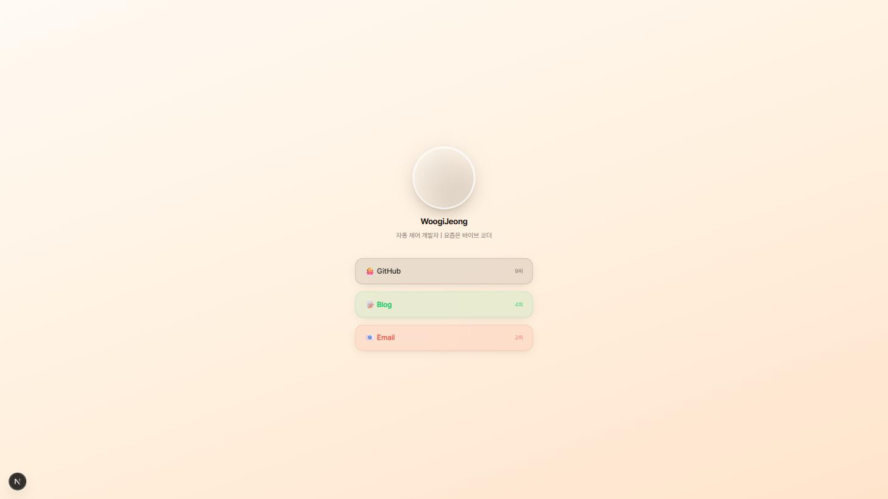

# 🌳 링크나무 (Linknamu)

Linktree처럼, 내 모든 링크를 하나의 페이지에 모아 두고 하나의 URL로 공유할 수 있는
Link-in-Bio 서비스입니다. 프로필과 링크 카드를 보여주고, 각 링크의 클릭 수를
MongoDB Atlas에 기록해 어떤 링크가 가장 많이 눌리는지 확인할 수 있습니다.

## 예시 화면



프로필 사진과 이름, 소개 문구가 상단에 표시되고, 그 아래로 링크 카드 목록이
나열됩니다. 각 카드에는 지금까지의 클릭 수가 함께 표시됩니다.

## 주요 기능

- **프로필 표시** — 이름, 소개 문구, 프로필 사진
- **링크 카드 목록** — 색상을 지정할 수 있는 커스텀 링크 카드
- **클릭 수 집계** — 링크 클릭 시 MongoDB Atlas에 클릭 수를 기록하고, 카드에
  실시간으로 표시

## 기술 스택

- [Next.js 16](https://nextjs.org) (App Router)
- [Tailwind CSS](https://tailwindcss.com)
- [MongoDB Atlas](https://www.mongodb.com/atlas) — 클릭 수 저장
- [Vercel](https://vercel.com) — 배포

## 시작하기

```bash
npm install
npm run dev
```

[http://localhost:3000](http://localhost:3000) 에서 결과를 확인할 수 있습니다.

`.env.local` 파일에 MongoDB 연결 문자열을 설정해야 클릭 수 기능이 동작합니다.

```bash
MONGODB_URI=your-mongodb-connection-string
```

## 프로젝트 구조

```
src/
  app/
    api/clicks/       # 클릭 수 조회·기록 API
    page.tsx           # 메인 프로필 페이지
  components/
    ProfileHeader.tsx   # 프로필 영역
    LinkCard.tsx         # 개별 링크 카드
    LinkList.tsx          # 링크 목록 + 클릭 수 상태 관리
  lib/
    mongodb.ts            # MongoDB Atlas 연결
```

## 코드 규칙

- TypeScript 사용
- 컴포넌트는 `src/components/` 아래에 작성
- 환경 변수는 `.env.local`에 저장 (절대 커밋하지 않음)
- 모바일 우선 반응형 디자인
